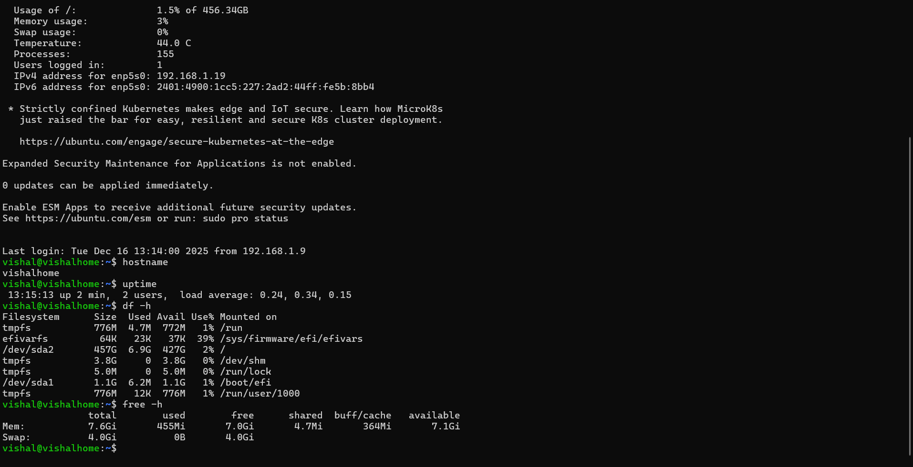

# Personal Linux Server

## Overview
This project converts an old laptop into a personal Linux server using Ubuntu Server.
The goal was to learn Linux fundamentals, server setup, and basic networking.

## Objectives
- Repurpose unused hardware
- Learn Linux command-line basics
- Configure file sharing and remote access

## Technologies Used
- Ubuntu Server
- Linux Command Line
- SSH
- Samba

## Features
- Installed Ubuntu Server on an old laptop
- Configured SSH for remote access
- Set up Samba for local file sharing
- Managed users and file permissions

## What I Learned
- Linux system administration basics
- File permissions and directory structure
- How servers work in a local network

## Future Improvements
- Add a web server (Apache/Nginx)
- Configure firewall rules
- Add cloud-style file access

## Conclusion
This project helped me gain practical experience with Linux servers and system management.

## Screenshots

### SSH Login

### System Status

